# Modelo de dados e carga no Power BI

## 1. Diagrama do modelo (estrela)

```mermaid
erDiagram
    dim_calendario ||--o{ fact_vendas : "data"
    dim_calendario ||--o{ fact_despesas : "data"
    dim_calendario ||--o{ fact_orcamento : "mes = data"
    dim_calendario ||--o{ fact_metas_vendas : "mes = data"
    dim_calendario ||--o{ fact_rh_mensal : "data_referencia = data"
    dim_filial ||--o{ fact_vendas : id_filial
    dim_filial ||--o{ fact_despesas : id_filial
    dim_filial ||--o{ fact_orcamento : id_filial
    dim_filial ||--o{ fact_metas_vendas : id_filial
    dim_filial ||--o{ fact_rh_mensal : id_filial
    dim_produto ||--o{ fact_vendas : id_produto
    dim_cliente ||--o{ fact_vendas : id_cliente
    dim_vendedor ||--o{ fact_vendas : id_vendedor
    dim_canal ||--o{ fact_vendas : id_canal
    dim_departamento ||--o{ fact_despesas : id_departamento
    dim_departamento ||--o{ fact_orcamento : id_departamento
    dim_departamento ||--o{ fact_rh_mensal : id_departamento
    dim_categoria_despesa ||--o{ fact_despesas : id_categoria_despesa
    dim_categoria_despesa ||--o{ fact_orcamento : id_categoria_despesa
```

**Todas as relações são 1:N, filtro em uma direção (dimensão → fato).** Não crie relações
entre fatos. As dimensões `dim_filial`, `dim_calendario`, `dim_departamento` e
`dim_categoria_despesa` filtram vários fatos ao mesmo tempo — é isso que permite comparar
vendas, despesas, orçamento e RH na mesma página.

### Passos obrigatórios

1. Em `dim_calendario`: **Ferramentas de tabela → Marcar como tabela de datas** → coluna `data`.
2. Ordene colunas de texto pelas colunas numéricas:
   - `mes_nome`, `mes_abrev` → `mes_num`
   - `mes_ano`, `ano_mes` → `ordem_ano_mes`
   - `dia_semana`, `dia_semana_abrev` → `dia_semana_num`
3. Em `dim_filial`: categorize `latitude`/`longitude` (*Categoria de dados*) e `cidade`/`uf` para mapas.
4. Oculte as colunas de chave (`id_*`) e as colunas numéricas brutas dos fatos (use medidas).
5. Desative **Data/Hora automática** (*Opções → Carregamento de dados*) — o calendário próprio resolve.

---

## 2. Como carregar os dados

### Opção A — direto do GitHub (recomendada, atualiza sozinha)

1. Suba o repositório no GitHub (veja o README). O repositório precisa ser **público** para o
   Power BI Desktop/Service ler sem autenticação. Se for privado, use a opção B.
2. No Power BI: **Transformar dados → Gerenciar parâmetros → Novo parâmetro**
   - Nome: `BaseUrl` · Tipo: Texto ·
     Valor: `https://raw.githubusercontent.com/SEU_USUARIO/SEU_REPO/main/data/`
3. Para cada arquivo em `powerbi/consultas_m/github/*.pq`:
   **Nova fonte → Consulta em branco → Editor Avançado** → cole o conteúdo → renomeie a
   consulta com o nome do arquivo (ex.: `fact_vendas`).
4. **Fechar e aplicar.**

> Se aparecer o aviso de privacidade, escolha *Anônimo* para `raw.githubusercontent.com`
> e nível de privacidade *Público*.

### Opção B — pasta local (repositório privado ou sem internet)

Mesmo processo, usando `powerbi/consultas_m/local/*.pq` e o parâmetro
`PastaLocal` = `C:\caminho\do\repo\data\` (com a barra final).

### Opção C — banco SQLite (`database/empresa_x.db`)

1. Instale o [driver ODBC do SQLite](http://www.ch-werner.de/sqliteodbc/).
2. *Obter dados → ODBC* e aponte para o `.db`.
3. Importe as tabelas `dim_*`/`fact_*` (modelo estrela) **ou** as views prontas:
   `vw_dre_mensal`, `vw_orcado_vs_realizado`, `vw_meta_vs_realizado_filial`,
   `vw_curva_abc_clientes`.

### Opção D — banco real (PostgreSQL / SQL Server / MySQL)

Use `sql/schema.sql` como base (troque os tipos conforme o SGBD), importe os CSVs com o
utilitário do seu banco e conecte o Power BI pelo conector nativo. Em **DirectQuery**, prefira
as views, que já agregam o pesado.

---

## 3. Atualizar com dados reais da sua empresa

Os CSVs seguem um contrato simples (veja `docs/dicionario_de_dados.md`). Para trocar os dados
fictícios pelos reais, basta manter **os mesmos nomes de colunas** e substituir os arquivos
(ou alimentar o banco). Prioridade de preenchimento:

1. `dim_filial`, `dim_departamento`, `dim_categoria_despesa` (cadastros pequenos)
2. `fact_despesas` e `fact_orcamento` (controle de gastos)
3. `fact_vendas`, `dim_produto`, `dim_cliente` (receita e lucro)
4. `fact_metas_vendas` e `fact_rh_mensal` (opcionais)

Para regenerar o calendário em outro período, altere `DATA_INICIO`, `DATA_CORTE` e `DATA_FIM`
no topo de `scripts/gerar_dados.py`.
